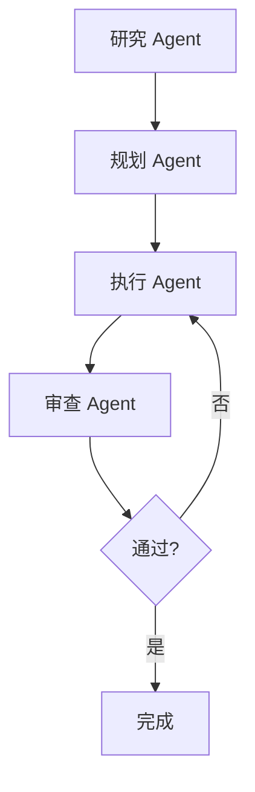

# 🤖 Agent 专业化策略

> **基于 OpenAI Harness Engineering 的 Agent 专业化实现**  
> 定义专业化 Agent 的角色、权限和协作模式

---

## 📋 **概述**

本文档定义了项目的 Agent 专业化策略，基于 OpenAI Harness Engineering 的最佳实践，通过专业化 Agent 提高 AI 开发的效率和质量。

---

## 🎯 **专业化原则**

### 📊 **专业化优势**
- **上下文优化**: 每个 Agent 专注于特定领域，减少上下文噪音
- **工具效率**: 专业化工具提高任务完成效率
- **质量保证**: 专业化 Agent 在特定领域表现更稳定
- **协作效率**: 明确的角色分工提高团队协作效率

### 🔒 **权限管理原则**
- **最小权限原则**: 每个 Agent 只拥有完成任务所需的最小权限
- **角色隔离**: 不同角色的 Agent 权限严格隔离
- **审计追踪**: 所有 Agent 操作都有完整的审计日志
- **安全边界**: 严格的权限边界防止越权操作

---

## 🤖 **Agent 角色定义**

### 🔍 **1. 研究 Agent (Research Agent)**

#### 📋 **职责范围**
- 代码库探索和分析
- 实现细节研究
- 技术方案调研
- 最佳实践研究

#### 🔐 **工具权限**
```typescript
interface ResearchAgentPermissions {
  // 只读权限
  read: true;
  grep: true;
  glob: true;
  search: true;
  
  // 禁止权限
  write: false;
  modify: false;
  delete: false;
  execute: false;
}
```

#### 🛠️ **可用工具**
```typescript
interface ResearchAgentTools {
  // 文件系统工具
  readFile: (path: string) => Promise<string>;
  listFiles: (dir: string) => Promise<FileList>;
  searchFiles: (pattern: string) => Promise<SearchResult[]>;
  
  // 代码分析工具
  analyzeCode: (code: string) => Promise<CodeAnalysis>;
  findDependencies: (file: string) => Promise<Dependency[]>;
  extractTypes: (file: string) => Promise<TypeDefinition[]>;
  
  // 搜索工具
  searchCode: (pattern: string) => Promise<SearchResult[]>;
  findReferences: (symbol: string) => Promise<Reference[]>;
}
```

#### 📝 **使用示例**
```typescript
// 研究任务示例
const researchTask = {
  type: 'research',
  target: 'user authentication system',
  scope: {
    files: ['src/auth/**/*', 'src/components/auth/**/*'],
    depth: 3,
    focus: ['implementation', 'dependencies', 'patterns']
  },
  deliverable: {
    analysis: 'detailed implementation analysis',
    dependencies: 'dependency graph',
    patterns: 'common patterns and best practices'
  }
};
```

---

### 📋 **2. 规划 Agent (Planning Agent)**

#### 📋 **职责范围**
- 需求分析和分解
- 任务结构化规划
- 里程碑定义
- 技术方案设计

#### 🔐 **工具权限**
```typescript
interface PlanningAgentPermissions {
  // 只读权限
  read: true;
  analyze: true;
  
  // 规划权限
  create: true;
  modify: ['docs/**/*', 'plans/**/*'];
  
  // 禁止权限
  modify: ['src/**/*', 'tests/**/*'];
  delete: false;
  execute: false;
}
```

#### 🛠️ **可用工具**
```typescript
interface PlanningAgentTools {
  // 分析工具
  analyzeRequirements: (requirements: string) => Promise<RequirementAnalysis>;
  decomposeTask: (task: Task) => Promise<TaskDecomposition>;
  estimateEffort: (task: Task) => Promise<EffortEstimate>;
  
  // 规划工具
  createMilestone: (milestone: Milestone) => Promise<Milestone>;
  updatePlan: (plan: Plan) => Promise<Plan>;
  validatePlan: (plan: Plan) => Promise<ValidationResult>;
  
  // 设计工具
  createDesign: (requirements: Requirements) => Promise<Design>;
  validateDesign: (design: Design) => Promise<ValidationResult>;
}
```

#### 📝 **使用示例**
```typescript
// 规划任务示例
const planningTask = {
  type: 'planning',
  requirements: 'Implement user authentication with OAuth2',
  scope: {
    features: ['email login', 'OAuth2 login', 'session management'],
    constraints: ['security', 'performance', 'maintainability'],
    timeline: '2 weeks'
  },
  deliverable: {
    milestones: 'detailed milestone breakdown',
    design: 'technical design document',
    plan: 'implementation plan with dependencies'
  }
};
```

---

### 🔧 **3. 执行 Agent (Execution Agent)**

#### 📋 **职责范围**
- 代码实现
- 测试编写
- 文档更新
- 错误修复

#### 🔐 **工具权限**
```typescript
interface ExecutionAgentPermissions {
  // 读写权限（限定范围）
  read: true;
  write: true;
  modify: true;
  
  // 执行权限（限定范围）
  execute: ['npm run test', 'npm run lint', 'npm run build'];
  
  // 禁止权限
  delete: false;
  system: false;
  network: ['api/*', 'cdn/*'];
}
```

#### 🛠️ **可用工具**
```typescript
interface ExecutionAgentTools {
  // 代码工具
  writeCode: (file: string, code: string) => Promise<void>;
  modifyCode: (file: string, modifications: CodeModification[]) => Promise<void>;
  formatCode: (code: string) => Promise<string>;
  
  // 测试工具
  runTests: (options?: TestOptions) => Promise<TestResult>;
  writeTest: (testFile: string, testCode: string) => Promise<void>;
  runCoverage: () => Promise<CoverageReport>;
  
  // 构建工具
  runBuild: (options?: BuildOptions) => Promise<BuildResult>;
  runLint: (options?: LintOptions) => Promise<LintResult>;
  
  // 验证工具
  validateCode: (code: string) => Promise<ValidationResult>;
  runTypeCheck: () => Promise<TypeCheckResult>;
}
```

#### 📝 **使用示例**
```typescript
// 执行任务示例
const executionTask = {
  type: 'execution',
  scope: {
    files: ['src/auth/components/LoginForm.tsx', 'src/auth/services/AuthService.ts'],
    tests: ['src/auth/components/LoginForm.test.tsx', 'src/auth/services/AuthService.test.ts'],
    docs: ['docs/auth/login-flow.md']
  },
  requirements: {
    functionality: 'OAuth2 login with email fallback',
    quality: '100% test coverage, zero lint errors',
    documentation: 'updated API documentation'
  },
  deliverable: {
    code: 'implemented components and services',
    tests: 'comprehensive test suite',
    docs: 'updated documentation'
  }
};
```

---

### 🔍 **4. 审查 Agent (Review Agent)**

#### 📋 **职责范围**
- 代码审查
- 质量检查
- 合规性验证
- 性能分析

#### 🔐 **工具权限**
```typescript
interface ReviewAgentPermissions {
  // 只读权限
  read: true;
  analyze: true;
  
  // 审查权限
  comment: true;
  suggest: true;
  
  // 禁止权限
  modify: false;
  delete: false;
  execute: false;
}
```

#### 🛠️ **可用工具**
```typescript
interface ReviewAgentTools {
  // 代码审查工具
  reviewCode: (code: string, context: ReviewContext) => Promise<CodeReview>;
  analyzeQuality: (code: string) => Promise<QualityAnalysis>;
  checkCompliance: (code: string, rules: ComplianceRules) => Promise<ComplianceResult>;
  
  // 性能分析工具
  analyzePerformance: (code: string) => Promise<PerformanceAnalysis>;
  checkBottlenecks: (code: string) => Promise<BottleneckAnalysis>;
  
  // 安全审查工具
  securityScan: (code: string) => Promise<SecurityScan>;
  checkVulnerabilities: (code: string) => Promise<VulnerabilityReport>;
  
  // 报告工具
  generateReport: (review: Review) => Promise<ReviewReport>;
  suggestImprovements: (issues: Issue[]) => Promise<ImprovementSuggestion[]>;
}
```

#### 📝 **使用示例**
```typescript
// 审查任务示例
const reviewTask = {
  type: 'review',
  scope: {
    files: ['src/auth/**/*', 'tests/auth/**/*'],
    criteria: ['security', 'performance', 'maintainability', 'test-coverage']
  },
  standards: {
    codeStyle: 'project coding standards',
    security: 'OWASP security guidelines',
    performance: 'performance budgets',
    testing: 'testing best practices'
  },
  deliverable: {
    review: 'detailed code review',
    report: 'comprehensive review report',
    suggestions: 'improvement suggestions'
  }
};
```

---

## 🔄 **协作模式**

### 📋 **协作流程**

#### 🔄 **标准协作流程**


#### 📝 **协作规则**
1. **顺序执行**: 研究 → 规划 → 执行 → 审查
2. **反馈循环**: 审查不通过时返回执行阶段
3. **权限隔离**: 每个 Agent 只在权限范围内操作
4. **状态同步**: 所有操作都有状态同步机制

### 🎭 **协作场景**

#### 🚀 **新功能开发**
```typescript
// 新功能开发协作流程
const newFeatureWorkflow = {
  research: {
    agent: 'research',
    task: '研究现有认证系统和最佳实践',
    output: 'research-report.md'
  },
  planning: {
    agent: 'planning',
    task: '设计 OAuth2 认证方案',
    input: 'research-report.md',
    output: 'auth-design.md'
  },
  execution: {
    agent: 'execution',
    task: '实现 OAuth2 认证功能',
    input: 'auth-design.md',
    output: 'implemented-code'
  },
  review: {
    agent: 'review',
    task: '审查认证代码质量和安全性',
    input: 'implemented-code',
    output: 'review-report.md'
  }
};
```

#### 🔧 **Bug 修复**
```typescript
// Bug 修复协作流程
const bugFixWorkflow = {
  research: {
    agent: 'research',
    task: '分析 Bug 根本原因',
    output: 'bug-analysis.md'
  },
  planning: {
    agent: 'planning',
    task: '制定修复方案',
    input: 'bug-analysis.md',
    output: 'fix-plan.md'
  },
  execution: {
    agent: 'execution',
    task: '实施修复',
    input: 'fix-plan.md',
    output: 'fixed-code'
  },
  review: {
    agent: 'review',
    task: '验证修复效果',
    input: 'fixed-code',
    output: 'verification-report.md'
  }
};
```

---

## 🛡️ **安全机制**

### 🔒 **权限控制**
```typescript
// 权限验证中间件
class PermissionMiddleware {
  static validatePermission(agent: Agent, action: Action): boolean {
    const permissions = agent.permissions;
    const requiredPermission = this.getRequiredPermission(action);
    
    return permissions.includes(requiredPermission);
  }
  
  static auditAction(agent: Agent, action: Action): void {
    const auditLog = {
      timestamp: new Date(),
      agent: agent.id,
      action: action.type,
      target: action.target,
      result: action.result
    };
    
    this.writeAuditLog(auditLog);
  }
}
```

### 📊 **操作审计**
```typescript
// 审计日志接口
interface AuditLog {
  timestamp: string;
  agentId: string;
  agentType: string;
  action: string;
  target: string;
  result: 'success' | 'failure' | 'error';
  error?: string;
  metadata: Record<string, any>;
}

// 审计管理器
class AuditManager {
  private logs: AuditLog[] = [];
  
  log(agent: Agent, action: Action, result: any): void {
    const log: AuditLog = {
      timestamp: new Date().toISOString(),
      agentId: agent.id,
      agentType: agent.type,
      action: action.type,
      target: action.target,
      result: result.success ? 'success' : 'failure',
      error: result.error,
      metadata: action.metadata
    };
    
    this.logs.push(log);
  }
  
  getAuditTrail(agentId: string, timeRange: TimeRange): AuditLog[] {
    return this.logs.filter(log => 
      log.agentId === agentId && 
      log.timestamp >= timeRange.start && 
      log.timestamp <= timeRange.end
    );
  }
}
```

---

## 📊 **性能监控**

### 📈 **Agent 性能指标**
```typescript
interface AgentMetrics {
  // 任务执行指标
  taskCompletionRate: number;
  averageTaskTime: number;
  successRate: number;
  errorRate: number;
  
  // 质量指标
  codeQuality: number;
  testCoverage: number;
  securityScore: number;
  performanceScore: number;
  
  // 协作指标
  collaborationEfficiency: number;
  feedbackResponseTime: number;
  revisionRate: number;
}
```

### 🔍 **监控工具**
```typescript
// 性能监控器
class AgentPerformanceMonitor {
  trackTask(agent: Agent, task: Task): void {
    const startTime = Date.now();
    
    task.onComplete(() => {
      const duration = Date.now() - startTime;
      this.updateMetrics(agent, task, duration);
    });
  }
  
  updateMetrics(agent: Agent, task: Task, duration: number): void {
    const metrics = agent.metrics;
    metrics.averageTaskTime = this.calculateAverageTime(metrics, duration);
    metrics.taskCompletionRate = this.calculateCompletionRate(metrics, task);
    
    this.saveMetrics(agent.id, metrics);
  }
}
```

---

## 📚 **相关文档**

- [HARNESS.md](../HARNESS.md) - 项目约束宪法
- [AGENTS.md](../AGENTS.md) - AI Agent 指南
- [strict-architecture-boundaries.md](./strict-architecture-boundaries.md) - 严格架构边界
- [agent-orchestration.md](./agent-orchestration.md) - Agent 编排机制

---

## 🎊 **总结**

Agent 专业化是 Harness Engineering 的关键要素，它通过明确的角色分工和权限管理，显著提高了 AI 开发的效率和质量。通过专业化 Agent，我们可以实现：

- **更高的效率**: 每个 Agent 专注于特定领域，减少上下文噪音
- **更好的质量**: 专业化 Agent 在特定领域表现更稳定
- **更强的安全性**: 严格的权限控制防止越权操作
- **更好的协作**: 明确的角色分工提高团队协作效率

---

*最后更新: 2026-03-13*  
*验证状态: ⏳ 待验证*  
*下次审查: 2026-03-20*
