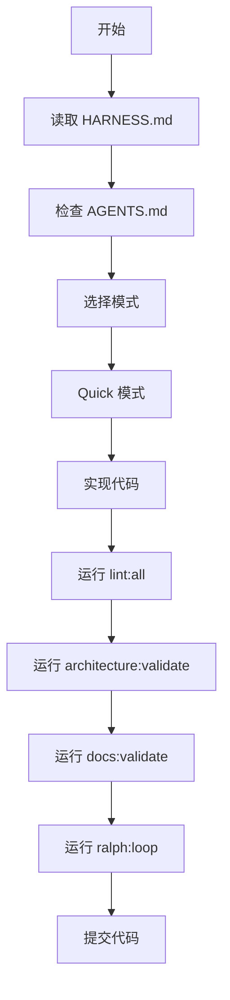

# 🛡️ Harness Engineering Requirements

> **OpenAI Harness Engineering 最佳实践的明确要求和规范**

---

## 📋 **概述**

本文档明确规定了 OpenAI Harness Engineering 最佳实践的具体要求和规范。所有 AI Agent 必须严格遵守这些要求。

---

## 🗺️ **记录系统要求 (OpenAI: "地图而非说明书")**

### 📋 **必须使用的记录系统**

#### ✅ **System Maps (架构地图)**
- **位置**: `docs/system-maps/`
- **要求**: 必须创建和维护完整的系统地图
- **内容**: 架构地图、领域地图、验证状态、核心理念
- **格式**: 标准化的 Markdown 格式 + 元数据

#### ✅ **OpenSpec (变更记录)**
- **位置**: `openspec/`
- **要求**: 必须记录所有变更和决策
- **内容**: proposal、spec、design、tasks 四件套
- **格式**: 标准 OpenSpec 格式

#### ✅ **验证状态追踪**
- **位置**: `docs/system-maps/validation-status.md`
- **要求**: 必须追踪所有文档的验证状态
- **内容**: 验证分数、问题列表、修复状态
- **更新**: 每次验证后必须更新

#### ✅ **核心理念定义**
- **位置**: `docs/system-maps/core-principles.md`
- **要求**: 必须明确定义项目核心理念
- **内容**: 愿景、价值观、技术理念、设计理念
- **维护**: 每季度审查和更新

### 🔍 **记录系统使用规则**

#### 📋 **Agent 使用规则**
1. **First**: 检查 `docs/system-maps/index.md` 了解整体结构
2. **Second**: 根据任务类型选择对应地图
3. **Third**: 遵循地图中的依赖和约束
4. **Fourth**: 更新相关地图记录变更

#### 📊 **记录系统验证要求**
- **每次任务**: 必须更新相关 System Maps
- **每周**: 运行 `npm run docs:validate` 验证文档质量
- **每月**: 更新验证状态和元数据
- **每季度**: 重新评估地图结构

---

## 🔍 **文档维护自动化要求 (OpenAI: "doc-gardening")**

### 🤖 **自动化维护工具**

#### ✅ **Doc-Gardening 智能体**
- **工具**: `scripts/utility/doc-gardening.cjs`
- **要求**: 必须定期运行 doc-gardening 扫描
- **功能**: 检查文档同步性、链接完整性、内容质量
- **频率**: 每周自动运行

#### ✅ **CI/CD 集成**
- **工具**: GitHub Actions 工作流
- **要求**: 必须通过 CI/CD 自动验证文档
- **触发**: 每次 push 和 PR 自动运行
- **报告**: 生成验证报告并自动评论

#### ✅ **自动修复机制**
- **工具**: `scripts/utility/docs-validator.cjs`
- **要求**: 必须自动修复断开的引用
- **功能**: 自动修复简单问题，报告复杂问题
- **PR**: 自动创建修复用的 Pull Request

### 📋 **文档维护规则**

#### 🔴 **严重问题 (必须立即修复)**
- 断开的代码引用
- 缺失的关键文档
- 架构不一致
- 严重的安全问题

#### 🟡 **中等问题 (48小时内修复)**
- 过时的元数据
- 轻微的格式问题
- 缺失的验证入口点
- 部分链接问题

#### 🟢 **轻微问题 (一周内修复)**
- 文档风格不一致
- 缺少最佳实践说明
- 可以改进的描述
- 非关键的问题

---

## 🏗️ **架构约束要求 (OpenAI: "严格边界和可预测结构")**

### 📋 **架构模型要求**

#### ✅ **严格分层架构**
```
Application Layer (应用层)
├── Routes/ (路由层)
├── Components/ (组件层)
├── Hooks/ (钩子层)
└── Utils/ (工具层)

Domain Layer (领域层)
├── Entities/ (实体)
├── Services/ (服务)
├── Repositories/ (仓储)
└── Types/ (领域类型)

Infrastructure Layer (基础设施层)
├── Database/ (数据库)
├── External APIs/ (外部 API)
├── Cache/ (缓存)
└── Storage/ (存储)
```

#### ✅ **依赖方向规则**
- **Application Layer** → **Domain Layer** ✅
- **Domain Layer** → **Infrastructure Layer** ✅ (通过接口)
- **Application Layer** → **Infrastructure Layer** ✅ (通过接口)
- **其他方向**: ❌ 禁止

#### ✅ **Providers 接口管理**
- **认证 Provider**: 管理用户认证
- **国际化 Provider**: 管理多语言支持
- **主题 Provider**: 管理主题切换
- **状态 Provider**: 管理全局状态

### 🔧 **架构约束执行**

#### ✅ **自定义 Lint 规则**
- **工具**: `scripts/lint/architecture-lint.js`
- **要求**: 必须运行架构 lint 检查
- **规则**: 跨层违规、命名约定、文件大小等
- **强制**: 必须通过所有架构 lint 规则

#### ✅ **结构测试**
- **工具**: `scripts/utility/architecture-validation.cjs`
- **要求**: 必须运行架构验证
- **检查**: 依赖方向、层级分离、接口使用
- **报告**: 生成详细的架构报告

#### ✅ **机械强制执行**
- **CI/CD**: 自动运行架构检查
- **PR**: 阻止架构违规的 PR 合并
- **报告**: 自动生成架构违规报告
- **修复**: 必须立即修复所有违规

---

## 🔧 **自定义 Lint 和品味不变式要求**

### 📋 **自定义 Lint 规则**

#### ✅ **架构 Lint 规则**
- **no-cross-layer-imports**: 禁止跨层导入
- **require-structured-logging**: 要求结构化日志
- **require-async-error-handling**: 要求异步函数错误处理
- **file-size-limit**: 文件大小限制
- **enforce-naming-conventions**: 强制命名约定

#### ✅ **品味不变式**
- **组件命名**: PascalCase (如 `UserProfile.tsx`)
- **Hook 命名**: use 前缀 (如 `useUserData.ts`)
- **工具函数**: camelCase (如 `formatDate.ts`)
- **常量命名**: UPPER_SNAKE_CASE (如 `API_BASE_URL.ts`)

#### ✅ **文件大小限制**
- **组件**: ≤ 500KB
- **路由**: ≤ 300KB
- **Hook**: ≤ 200KB
- **工具**: ≤ 400KB
- **其他**: ≤ 1MB

### 🔧 **强制执行规则**

#### 📋 **Lint 检查要求**
- **每次提交**: 运行 `npm run lint:all`
- **每次 PR**: CI 自动运行 lint 检查
- **自定义规则**: 必须通过所有自定义 lint 规则
- **违规修复**: 必须立即修复所有 lint 违规

#### 📊 **Lint 报告要求**
- **详细报告**: 必须生成详细的 lint 报告
- **分类统计**: 按类型分类统计违规
- **修复建议**: 提供具体的修复建议
- **趋势分析**: 追踪违规趋势

---

## 🚀 **工作流程集成**

### 📋 **标准工作流程**

#### 🔄 **Quick 模式工作流程**


#### 🔄 **BMM 模式工作流程**
```mermaid
flowchart TD
    A[开始] --> B[读取 HARNESS.md]
    B --> C[检查 AGENTS.md]
    C --> D[选择模式]
    D --> E[BMM 模式]
    E --> F[@brief 需求分析]
    F --> G[@spec 技术设计]
    G --> H[@dev-story 实现故事]
    H --> I[@quality 质量检查]
    I --> J[@check 验证测试]
    J --> K[@archive 归档总结]
    K --> L[运行所有验证]
    L --> M[提交代码]
```

### 📋 **验证检查点**

#### 🔍 **必须通过的检查点**
1. **HARNESS 合规检查**: `npm run harness:validate`
2. **架构约束检查**: `npm run architecture:validate`
3. **自定义 Lint 检查**: `npm run lint:architecture`
4. **文档验证检查**: `npm run docs:validate`
5. **Ralph Loop**: `npm run ralph:loop`

#### 🚨 **失败处理**
- 🔴 **严重失败**: 阻止提交，必须立即修复
- 🟡 **中等失败**: 需要解释，48小时内修复
- 🟢 **轻微失败**: 记录改进，一周内修复

---

## 📊 **质量指标要求**

### 📈 **关键指标**
- **开发效率**: 3.5+ PR/工程师/天
- **代码质量**: 100% HARNESS 合规
- **测试覆盖**: ≥ 85%
- **性能分数**: ≥ 90 Lighthouse
- **文档质量**: ≥ 90% 文档验证分数
- **架构合规**: 100% 架构约束合规
- **Lint 合规**: 100% 自定义 lint 合规

### 📊 **质量追踪**
```typescript
interface QualityMetrics {
  prPerEngineerPerDay: number;      // PR/工程师/天
  harnessComplianceRate: number;    // HARNESS 合规率
  testCoverage: number;             // 测试覆盖率
  lighthouseScore: number;          // Lighthouse 分数
  bundleSize: number;              // Bundle 大小
  performanceScore: number;         // 性能分数
  docsValidationScore: number;      // 文档验证分数
  architectureCompliance: number;   // 架构合规率
  lintComplianceRate: number;       // Lint 合规率
}
```

---

## 🔄 **持续改进**

### 📅 **定期检查**
- **每周**: 质量指标回顾 + 文档验证
- **每月**: HARNESS.md 更新 + 架构评估
- **每季度**: 工作流程优化 + 工具升级
- **每半年**: 架构评估 + 原则更新

### 🔄 **改进机制**
1. **收集反馈**: 从团队和工具收集反馈
2. **分析指标**: 分析质量指标趋势
3. **优化流程**: 优化工作流程和工具
4. **更新文档**: 更新相关文档
5. **培训团队**: 培训团队使用新流程

---

## 🎯 **成功标准**

### ✅ **必须达到的标准**
- **100% HARNESS 合规**: 零 HARNESS 违规
- **100% 架构合规**: 零架构约束违规
- **100% Lint 合规**: 零自定义 lint 违规
- **90%+ 文档质量**: 文档验证分数 ≥ 90%
- **85%+ 测试覆盖**: 测试覆盖率 ≥ 85%
- **90%+ 性能分数**: Lighthouse 分数 ≥ 90

### 🎊 **优秀标准**
- **3.5+ PR/工程师/天**: 达到 OpenAI 基准
- **8-10x 开发速度**: 相比传统开发
- **零质量退化**: 持续改进
- **自动化率**: 95%+ 自动化检查

---

## 📚 **相关文档**

- [HARNESS.md](../HARNESS.md 是项目的"宪法"，确保代码质量、架构一致性和长期可维护性。
- [AGENTS.md](../AGENTS.md) - AI Agent 指南
- [System Maps](../../docs/system-maps/) - 系统地图
- [Ralph Loop](../workflows/ralph-loop.md) - 自我迭代闭环

---

## 🎊 **总结**

这些要求确保项目完全对齐 OpenAI Harness Engineering 的最佳实践，实现工业化级别的开发效率和质量保证。

**记住：这些不是可选项，而是必须遵守的要求。**
